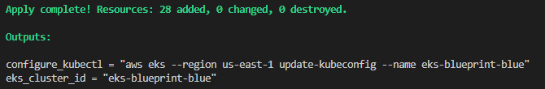
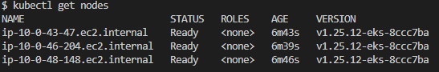
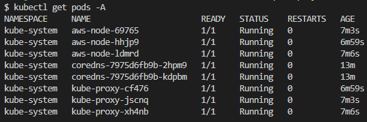

**EKS Blueprints for Terraform**

Esse repo é uma cópia do Workshop abaixo, tivemos muitos problemas com pacotes quebrados, arrumamos tudo e criamos e esse repo. 
https://catalog.workshops.aws/eks-blueprints-terraform/en-US

Repositório de referencia: https://catalog.workshops.aws/eks-blueprints-terraform/en-US

###### Limpar o repo .terraform antes de publicar

Deploy do Cluster
- Download do repo
- Acece a pasta enviroment
- Configure o TFVARS
- Execute o terraform
Acesse o diretório eks-blue
- Configure o TFVARS
- Execute o terraform

Ao termino teremos a output com o comando kubectl para autenticar no cluster

Execute o comando para autenticar
- aws eks --region us-east-1 update-kubeconfig --name eks-blueprint-blue
Execute alguns comandos para testes
- kubectl get nodes

- kubectl get pods -A
